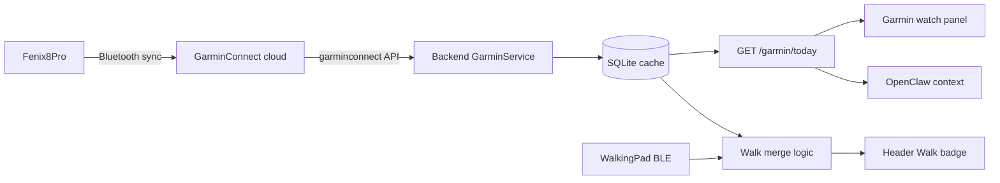

# Garmin Fenix 8 Pro Dashboard Integration

> Future work — not implemented yet. Plan for adding Garmin Connect stats to the Chili home dashboard.

## Overview

Add Garmin Connect sync to the Pi dashboard using the maintained [`garminconnect`](https://github.com/cyberjunky/python-garminconnect) Python library (personal/unofficial path). Display sleep, HR, stress, and activities in a new watch panel, and merge Garmin walk/run stats into the existing Walk header badge when Walking Pad data is missing.

## Recommendation: use `garminconnect`, not the official Garmin API

For a personal home dashboard on the Pi, the practical path is **python-garminconnect** (~130 API methods, actively maintained, token auto-refresh).

| Approach | Fit for personal Pi dashboard |
|----------|-------------------------------|
| **Official Garmin Connect Developer Program** | Enterprise-only; personal apps are rejected; program access is often suspended for new applicants |
| **`garminconnect` library** | Same data the Fenix syncs to Garmin Connect; works with an existing account; standard for personal Pi/Notion dashboards |

**Tradeoffs to accept:**

- Uses unofficial Garmin Connect endpoints (can break if Garmin changes auth)
- One-time MFA login on the Pi to seed tokens
- `GARMIN_EMAIL` / `GARMIN_PASSWORD` stored in `.env` (never committed)



## v1 scope

### Garmin stats on dashboard

- Last-night **sleep** (duration + score)
- **Resting heart rate**
- **Stress / Body Battery** (today snapshot)
- **Latest workout** (type, duration, distance)
- **Walk/run distance & time** (today)

Steps and step goal were intentionally deferred for v1.

### Walking Pad merge rule

- Walking Pad remains authoritative when it has fresh data today (BLE or manual log)
- When pad totals are **0** or collector is **stale/unavailable**, fall back to Garmin walk+run totals in the header Walk badge
- Meta line shows source: `via Garmin` when fallback is active

## Backend architecture

Follow existing patterns from `backend/app/domain/weather.py` (cached fetch) and `backend/app/jobs/sensor_polling.py` (background poller).

### 1. Garmin service — `backend/app/domain/garmin.py`

- Wrap `garminconnect.Garmin` with thin adapter (easy to mock in tests)
- Config via `backend/app/core/settings.py`:
  - `GARMIN_EMAIL`, `GARMIN_PASSWORD`
  - `GARMIN_TOKEN_DIR=/data/garminconnect` (persist tokens across restarts)
  - `GARMIN_POLL_INTERVAL_SECONDS=1800` (30 min; Fenix syncs periodically, no need for real-time)
- Fetch and normalize daily snapshot:
  - `get_stats(date)` / `get_sleep_data(date)` / `get_activities(start, limit=1)`
  - Map to a stable dataclass: `GarminTodaySnapshot` with status `not_configured | ready | unavailable`
- Cache last good snapshot in SQLite (survives restarts; avoids hammering Garmin on every page load)

### 2. Database — extend `backend/app/database/models.py`

New table `garmin_daily_snapshots`:

- `local_date`, `synced_at`
- `resting_hr`, `body_battery`, `stress_avg`
- `sleep_seconds`, `sleep_score`
- `walk_duration_seconds`, `walk_distance_km`, `run_duration_seconds`, `run_distance_km`
- `latest_activity_type`, `latest_activity_duration_seconds`, `latest_activity_distance_km`, `latest_activity_started_at`

### 3. Background poller — `backend/app/jobs/garmin_polling.py`

- Same loop pattern as sensor poller
- Run only when `GARMIN_EMAIL` is set
- Wire in `backend/app/main.py` lifespan alongside `run_sensor_poller`

### 4. One-time MFA setup — `backend/app/tools/garmin_login.py`

Interactive CLI for first login (MFA prompt):

```bash
docker compose -f compose.yaml -f compose.pi.yaml run --rm backend python -m app.tools.garmin_login
```

Tokens saved to mounted volume `./data/garminconnect`. After that, poller auto-refreshes tokens.

### 5. API — `backend/app/api/router.py`

- `GET /api/v1/garmin/today` → sleep, HR, stress/body battery, latest activity, walk/run totals
- Extend `GET /api/v1/walkingpad/today` (or add `GET /api/v1/walking/today`) with merged fields:
  - `effective_minutes`, `effective_distance_km`, `data_source: "pad" | "garmin" | "pad+garmin"`
  - Keeps existing Walking Pad fields unchanged for debugging

### 6. Walk merge logic — `backend/app/domain/walkingpad.py` or small helper

```python
# Pseudocode
if pad_has_fresh_data_today:
    effective = pad_totals
    source = "pad"
elif garmin_has_walk_run:
    effective = garmin_walk_run_totals
    source = "garmin"
else:
    effective = zeros
```

“Fresh pad data” = sessions today OR `synced_at` within existing 15-min stale window.

### 7. OpenClaw context — `backend/app/domain/dashboard_context.py`

Add lines like:

- `- Garmin: sleep 7h12 score 82; resting HR 54; body battery 68; latest run 5.2 km.`
- `- Walk totals: 30/60 min (source: garmin fallback).`

## Frontend

### 1. New watch panel — `frontend/src/components/GarminPanel.tsx`

Place in sidebar under **System** (alongside `SystemHealthPanel.tsx`):

| Metric | Display |
|--------|---------|
| Sleep | `7h 12m · score 82` |
| Resting HR | `54 bpm` |
| Body Battery / Stress | current or daily avg |
| Latest activity | `Run · 5.2 km · 32 min` |
| Walk/run today | supporting line for merge context |

Hidden when `status === 'not_configured'`.

### 2. Header Walk badge — `frontend/src/components/WalkingPadBadge.tsx`

- Use `effective_minutes` / `effective_distance_km` when present
- Meta: `via Garmin` when source is garmin

### 3. Data hooks — `useDashboardData.ts`, `useStartupBoot.ts`

- Poll `GET /garmin/today` every 30 min
- Add **Garmin** row to startup splash checklist

## Config

Update `.env.example` and `README.md`:

```env
GARMIN_EMAIL=
GARMIN_PASSWORD=
GARMIN_TOKEN_DIR=/data/garminconnect
GARMIN_POLL_INTERVAL_SECONDS=1800
```

Mount in `compose.yaml` backend volumes:

```yaml
- ./data/garminconnect:/data/garminconnect
```

Add dependency: `garminconnect>=0.3.5` in `backend/pyproject.toml`.

## Tests

- `backend/tests/test_garmin.py` — mock client, snapshot parsing
- `backend/tests/test_walking_merge.py` — pad fresh vs stale vs garmin fallback
- API test for `GET /garmin/today`

## Security notes

- Credentials only in `.env` on Pi; tokens in `./data/garminconnect/` (gitignored)
- No Garmin credentials sent to browser
- Unofficial API: fine for personal use; do not expose dashboard publicly without auth

## Future enhancements (out of v1)

- Steps + step goal
- Additive merge (pad + outdoor Garmin when both active) with dedupe
- Historical charts (7-day sleep trend)
- Official Garmin Health API if enterprise developer access is obtained later

## Implementation checklist

- [ ] Add GarminService + SQLite snapshot model + garminconnect dependency
- [ ] Background poller, MFA login tool, compose volume mount, settings/.env
- [ ] `GET /garmin/today` + walk merge fields on walking endpoint
- [ ] GarminPanel sidebar widget, Walk badge merge display, startup boot check
- [ ] OpenClaw context lines, unit/API tests, README setup section
